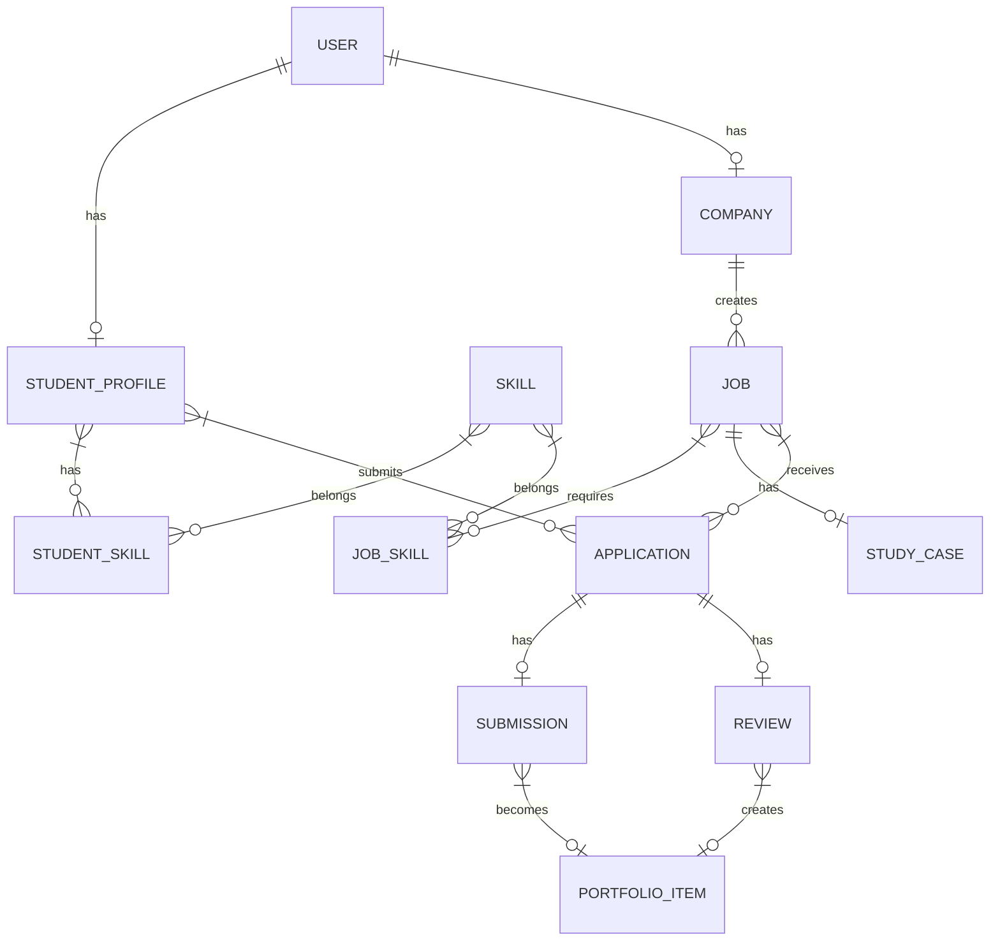

# PKL Platform — Technical Design

## Architecture Overview

```
┌─────────────┐     ┌──────────────────┐     ┌─────────────┐     ┌──────────────────┐
│   Browser   │────▶│     Next.js      │────▶│   Prisma    │────▶│  Neon PostgreSQL │
│  (React 19) │     │  (App Router)    │     │   ORM       │     │   (Serverless)   │
└─────────────┘     └──────────────────┘     └─────────────┘     └──────────────────┘
                           │
                           ▼
                    ┌──────────────────┐
                    │ Server Actions   │
                    │ Route Handlers   │
                    └──────────────────┘
```

**Principles:**
- Simplest architecture possible
- No separate backend service
- Server Actions for mutations, Route Handlers for webhooks/API
- Prisma as single data access layer
- Type-safe end-to-end with TypeScript

---

## Application Flow

### Request Flow
1. Browser requests page → Next.js Server Component renders
2. User action (form submit) → Server Action executes
3. Server Action validates → Prisma mutation → revalidates path
4. Response → UI updates

### Authentication Flow
1. User submits credentials → Server Action validates
2. Creates session cookie (httpOnly, secure, sameSite=lax)
3. Middleware checks session on protected routes
4. Role extracted from session → authorization checks in Server Actions

---

## Database Model



### Core Entities

#### User
```prisma
model User {
  id            String    @id @default(cuid())
  email         String    @unique
  passwordHash  String
  role          Role      @default(STUDENT)
  createdAt     DateTime  @default(now())
  updatedAt     DateTime  @updatedAt
  studentProfile StudentProfile?
  company       Company?
}
```

#### StudentProfile
```prisma
model StudentProfile {
  id        String   @id @default(cuid())
  userId    String   @unique
  user      User     @relation(fields: [userId], references: [id], onDelete: Cascade)
  name      String
  major     Major
  bio       String?
  skills    StudentSkill[]
  applications Application[]
  portfolioItems PortfolioItem[]
  createdAt DateTime @default(now())
  updatedAt DateTime @updatedAt
}
```

#### Company
```prisma
model Company {
  id          String   @id @default(cuid())
  userId      String   @unique
  user        User     @relation(fields: [userId], references: [id], onDelete: Cascade)
  name        String
  description String?
  location    String?
  website     String?
  verified    Boolean  @default(false)
  jobs        Job[]
  createdAt   DateTime @default(now())
  updatedAt   DateTime @updatedAt
}
```

#### Skill
```prisma
model Skill {
  id              String          @id @default(cuid())
  name            String          @unique
  category        SkillCategory   @default(TECHNICAL)
  studentSkills   StudentSkill[]
  jobSkills       JobSkill[]
}
```

#### Job
```prisma
model Job {
  id              String       @id @default(cuid())
  companyId       String
  company         Company      @relation(fields: [companyId], references: [id], onDelete: Cascade)
  title           String
  description     String
  location        String
  techStack       String[]
  applicationDeadline DateTime
  skills          JobSkill[]
  studyCase       StudyCase?
  applications    Application[]
  createdAt       DateTime     @default(now())
  updatedAt       DateTime     @updatedAt
}
```

#### StudyCase
```prisma
model StudyCase {
  id            String       @id @default(cuid())
  jobId         String       @unique
  job           Job          @relation(fields: [jobId], references: [id], onDelete: Cascade)
  title         String
  problemDescription String
  instructions  String
  requiredSkills String[]
  deadline      DateTime
  createdAt     DateTime     @default(now())
  updatedAt     DateTime     @updatedAt
}
```

#### Application
```prisma
model Application {
  id          String        @id @default(cuid())
  studentId   String
  student     StudentProfile @relation(fields: [studentId], references: [id], onDelete: Cascade)
  jobId       String
  job         Job           @relation(fields: [jobId], references: [id], onDelete: Cascade)
  status      ApplicationStatus @default(PENDING)
  submission  Submission?
  review      Review?
  portfolioItem PortfolioItem?
  createdAt   DateTime      @default(now())
  updatedAt   DateTime      @updatedAt

  @@unique([studentId, jobId])
}
```

#### Submission
```prisma
model Submission {
  id            String       @id @default(cuid())
  applicationId String       @unique
  application   Application  @relation(fields: [applicationId], references: [id], onDelete: Cascade)
  repoUrl       String
  deployedUrl   String?
  explanation   String
  submittedAt   DateTime     @default(now())
}
```

#### Review
```prisma
model Review {
  id            String       @id @default(cuid())
  applicationId String       @unique
  application   Application  @relation(fields: [applicationId], references: [id], onDelete: Cascade)
  score         Int          // 0-100
  feedback      String
  decision      Decision     // ACCEPTED or REJECTED
  reviewedAt    DateTime     @default(now())
}
```

#### PortfolioItem
```prisma
model PortfolioItem {
  id              String       @id @default(cuid())
  studentId       String
  student         StudentProfile @relation(fields: [studentId], references: [id], onDelete: Cascade)
  studyCaseTitle  String
  companyName     String
  technologies    String[]
  repoUrl         String
  deployedUrl     String?
  score           Int
  feedback        String
  result          Decision     // ACCEPTED or REJECTED
  createdAt       DateTime     @default(now())
}
```

### Enums
```prisma
enum Role {
  STUDENT
  COMPANY
}

enum Major {
  RPL
  TKJ
  PPLG
  OTHER
}

enum SkillCategory {
  TECHNICAL
  SOFT
  LANGUAGE
  FRAMEWORK
  DATABASE
  TOOL
  CLOUD
  OTHER
}

enum ApplicationStatus {
  PENDING
  REVIEWED
  ACCEPTED
  REJECTED
}

enum Decision {
  ACCEPTED
  REJECTED
}
```

### Indexes
- User.email (unique)
- StudentProfile.userId (unique)
- Company.userId (unique)
- Skill.name (unique)
- Job.companyId
- Application.studentId, Application.jobId (unique composite)
- Submission.applicationId (unique)
- Review.applicationId (unique)
- PortfolioItem.studentId

---

## Core Data Flow

### Student Registration
```
POST /auth/register (Server Action)
  → validate input
  → hash password (bcrypt)
  → create User + StudentProfile
  → create session cookie
  → redirect to /student/profile
```

### Company Job Creation
```
POST /company/jobs (Server Action)
  → verify company role
  → create Job + JobSkill relations
  → create StudyCase
  → revalidate /company/jobs
```

### Student Application
```
POST /student/jobs/[id]/apply (Server Action)
  → verify student role
  → check not already applied
  → create Application (PENDING)
  → revalidate /student/jobs
```

### Study Case Submission
```
POST /student/applications/[id]/submit (Server Action)
  → verify ownership
  → check status = PENDING
  → create Submission
  → update Application status = REVIEWED
  → revalidate /student/applications/[id]
```

### Company Review
```
POST /company/applications/[id]/review (Server Action)
  → verify company owns job
  → create Review (score, feedback, decision)
  → update Application status = ACCEPTED/REJECTED
  → create PortfolioItem (always, regardless of decision)
  → revalidate /company/applications/[id]
```

---

## Authentication

**Solution:** Custom session-based auth with bcrypt + cookies

**Why not NextAuth/Auth.js?**
- Adds dependency
- Overkill for two roles
- Custom gives full control for hackathon speed

**Implementation:**
- `lib/auth.ts` — password hashing, session creation, validation
- `lib/session.ts` — cookie management (iron-session or custom JWT in cookie)
- Middleware `middleware.ts` — protects routes, attaches user to request

**Session Payload:**
```typescript
interface SessionUser {
  id: string
  email: string
  role: 'STUDENT' | 'COMPANY'
}
```

---

## Authorization

**Rule:** Never trust client. Every Server Action validates:

```typescript
// Example pattern
export async function createJob(data: JobInput) {
  const session = await getSession()
  if (!session || session.role !== 'COMPANY') {
    throw new Error('Unauthorized')
  }
  const company = await prisma.company.findUnique({
    where: { userId: session.id }
  })
  if (!company) throw new Error('Company profile required')
  // ... create job with companyId
}
```

**Ownership Checks:**
- Student can only access own profile, applications, submissions, portfolio
- Company can only access own company profile, jobs, applications for their jobs

---

## Backend Interfaces

### Server Actions (Mutations)

| Action | Input | Output | Auth |
|--------|-------|--------|------|
| `registerStudent(email, password, name, major)` | RegisterInput | { userId } | Public |
| `registerCompany(email, password, name)` | RegisterInput | { userId } | Public |
| `login(email, password)` | LoginInput | { success } | Public |
| `logout()` | void | { success } | Auth |
| `updateStudentProfile(data)` | ProfileInput | StudentProfile | Student |
| `addStudentSkill(skillId)` | string | StudentSkill | Student |
| `removeStudentSkill(skillId)` | string | void | Student |
| `createCompanyProfile(data)` | CompanyProfileInput | Company | Company |
| `createJob(data)` | JobInput | Job | Company |
| `createStudyCase(jobId, data)` | StudyCaseInput | StudyCase | Company |
| `applyToJob(jobId)` | string | Application | Student |
| `submitStudyCase(applicationId, data)` | SubmissionInput | Submission | Student |
| `reviewApplication(applicationId, data)` | ReviewInput | Review + PortfolioItem | Company |

### Route Handlers (GET)

| Route | Purpose | Auth |
|-------|---------|------|
| `GET /api/jobs` | List jobs with matching scores | Student |
| `GET /api/jobs/[id]` | Job detail + study case | Student/Company |
| `GET /api/student/applications` | Student's applications | Student |
| `GET /api/company/applications` | Company's job applications | Company |
| `GET /api/student/portfolio` | Student portfolio | Student |
| `GET /api/skills` | All skills (for selects) | Public |

---

## Matching Engine Design

### Algorithm: Weighted Jaccard Similarity

```typescript
function calculateMatch(student: StudentProfile, job: Job): MatchResult {
  const studentSkills = new Set(student.skills.map(s => s.skill.name.toLowerCase()))
  const jobSkills = new Set(job.skills.map(s => s.skill.name.toLowerCase()))
  const jobTechStack = new Set(job.techStack.map(t => t.toLowerCase()))
  
  // Combine job requirements
  const allJobRequirements = new Set([...jobSkills, ...jobTechStack])
  
  // Intersection
  const matched = [...studentSkills].filter(s => allJobRequirements.has(s))
  const matchCount = matched.length
  const totalRequirements = allJobRequirements.size
  
  // Weighted score
  const skillWeight = 0.7
  const majorWeight = 0.3
  
  const skillScore = totalRequirements > 0 ? matchCount / totalRequirements : 0
  const majorScore = student.major === mapJobMajor(job) ? 1 : 0
  
  const finalScore = Math.round((skillScore * skillWeight + majorScore * majorWeight) * 100)
  
  return {
    percentage: finalScore,
    matchedSkills: matched,
    missingSkills: [...allJobRequirements].filter(s => !studentSkills.has(s)),
    majorMatches: majorScore === 1
  }
}
```

### Major Mapping
```typescript
function mapJobMajor(job: Job): Major {
  // Infer from tech stack / required skills
  const tech = job.techStack.join(' ').toLowerCase()
  const skills = job.skills.map(s => s.skill.name.toLowerCase()).join(' ')
  const all = tech + ' ' + skills
  
  if (all.includes('react') || all.includes('next') || all.includes('node') || all.includes('typescript') || all.includes('javascript')) return 'RPL'
  if (all.includes('network') || all.includes('cisco') || all.includes('mikrotik') || all.includes('linux')) return 'TKJ'
  if (all.includes('flutter') || all.includes('dart') || all.includes('mobile') || all.includes('android') || all.includes('ios')) return 'PPLG'
  return 'OTHER'
}
```

### Deterministic & Explainable
- No randomness, no ML
- Same input → same output
- Returns matched skills array for UI display
- Easy to debug and adjust weights

---

## Deployment Architecture

```
┌──────────────┐     ┌──────────────┐     ┌──────────────┐
│   GitHub     │────▶│    Vercel    │────▶│    Neon      │
│   (Source)   │     │  (Hosting)   │     │  (PostgreSQL)│
└──────────────┘     └──────────────┘     └──────────────┘
                            │
                            ▼
                     ┌──────────────┐
                     │  Environment │
                     │  Variables   │
                     └──────────────┘
```

**Vercel Config:**
- Build command: `prisma generate && next build`
- Environment: `DATABASE_URL`, `SESSION_SECRET`, `NODE_ENV=production`

**Neon:**
- Serverless PostgreSQL
- Connection pooling via PgBouncer
- Branch for preview deployments

---

## Technical Trade-offs

| Decision | Trade-off | Rationale |
|----------|-----------|-----------|
| Custom auth vs NextAuth | More code, less dependency | Hackathon speed, full control |
| Server Actions vs API routes | Tied to Next.js | Simpler, type-safe, less boilerplate |
| Single StudyCase per Job | Less flexible | MVP scope, simpler data model |
| Deterministic matching | Less "smart" | Explainable, no ML infra, hackathon-appropriate |
| No file upload | Limited submission types | Avoids storage complexity, URLs sufficient for demo |
| Enum for Major | Fixed list | Indonesian SMK context, controlled vocabulary |
| No School entity | Missing stakeholder | Out of MVP scope per requirements |

---

## Security Considerations

- Passwords: bcrypt with cost 12
- Sessions: httpOnly, secure, sameSite=lax cookies
- CSRF: SameSite cookie + origin check on mutations
- XSS: React auto-escapes, no dangerouslySetInnerHTML
- SQL Injection: Prisma parameterized queries
- Authorization: Every Server Action checks role + ownership
- Rate limiting: Vercel edge defaults (add later if needed)